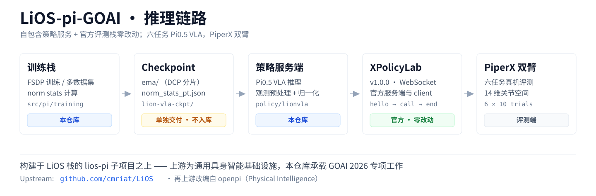

# LiOS-pi-GOAI

**面向 PiperX 双臂机器人的六任务 Pi0.5 视觉-语言-动作推理栈。**

本项目是 [**LiOS**](https://github.com/cmriat/LiOS) 具身智能基础设施栈中
[`lios-pi`](https://github.com/cmriat/LiOS/tree/main/lios-pi) 子项目的延伸。

[English](README.en.md) | **简体中文**

[](LICENSE)
[](pixi.toml)



---

## 概述

LiOS-pi-GOAI 提供在 GOAI 2026 真机赛道上复现六任务双臂策略所需的全部内容：模型、
产出该模型的训练栈，以及一层**在不修改官方评测代码的前提下**实现 **XPolicyLab v1.0.0**
协议的服务端。

策略为在六个真机操作任务上微调得到的 Pi0.5 VLA。推理链路自包含——不依赖任何外部私有
包——评测方在本仓库 + 单独交付的 checkpoint 之外无需任何额外准备即可复现运行。

## 与 LiOS 的关系

本项目**延伸 [`lios-pi`](https://github.com/cmriat/LiOS/tree/main/lios-pi)，而非从它分叉**。
上游 [LiOS](https://github.com/cmriat/LiOS) 仓库描述的是通用的具身智能栈（`lios-pi` 提供
VLA 模型，`lios-webrtc` 负责端到云图像传输）；本仓库承载建立在其之上的 GOAI 2026 专项工作。

| | |
|---|---|
| **继承自 `lios-pi`** | Pi0 / Pi0.5 的 PyTorch 实现（其上游移植自 [openpi](https://github.com/Physical-Intelligence/openpi)）、PaliGemma / Gemma / SigLIP transformer 栈、FSDP 训练循环、归一化与图像工具 |
| **本仓库新增** | GOAI 真机任务与数据管线、PiperX 14 维 state/action 契约、XPolicyLab 服务层与 `lionvla` 策略插件、动作重采样、按任务推理配置、推理落盘 trace，以及比赛提交文档 |

软件来源与授权记录见 [`NOTICE`](NOTICE)。

## 特性

- **推理自包含** —— 模型、tokenizer 与服务代码全部在仓库内，评测无需私有包，运行期无需联网。
- **官方服务端零改动** —— 策略通过一层很薄的 `policy/lionvla/` 适配器接入未经修改的官方
  XPolicyLab 服务端。仓库的客户端侧代码不含任何控制逻辑。
- **PiperX 关节空间契约** —— 有明确文档的 14 维 state/action 布局（左臂 6 关节 + 左夹爪 +
  右臂 6 关节 + 右夹爪），训练与推理共用同一套定义。
- **可选的动作重采样** —— 用保形的 PCHIP 插值对预测动作块做时间压缩，以更快的播放速度
  换取更长的有效预测跨度。默认关闭。详见 [`docs-GOAI/action_resampling.md`](docs-GOAI/action_resampling.md)。
- **推理落盘 trace** —— 可按需把每次调用记录到磁盘（三路相机帧、state、最终动作块与分段
  耗时），供离线复盘；附一个只读的[查看器](tools/trace_viewer.py)。默认关闭。

## 快速上手

需要 [pixi](https://pixi.sh)。环境锁定为 Python 3.10 / PyTorch 2.7.1（CUDA 12.9）。

```bash
pixi install --locked

# 把 configs/goai_real/server.yaml 里的 checkpoint_path 指向交付的 checkpoint，
# 然后启动真机策略服务端。
pixi run serve_goai
```

服务端就绪后会打印一行 `READY FOR INFERENCE ws://<host>:<port>`。

若要单独跑仿真服务端或做协议冒烟测试：

```bash
pixi run -e goai-inference python scripts/inference/goai/sim_server.py \
  --checkpoint lion-vla-ckpt/ema \
  --norm-stats lion-vla-ckpt/norm_stats_pt.json \
  --task-name stack_bowls \
  --config-name pi05_goai_joint \
  --host 0.0.0.0 --port 28000 \
  --device cuda:0 --norm-mode per-timestamp --apply-delta --seed 0

curl http://127.0.0.1:28000/healthz
```

## 模型权重

checkpoint 权重、归一化统计与 manifest **不入库**。它们单独交付，解压到 `lion-vla-ckpt/`，
保持以下相对结构：

```
lion-vla-ckpt/
├── ema/                  # DCP 分片 + .metadata
└── norm_stats_pt.json    # 逐时间戳的动作归一化统计
```

tokenizer 已内置于 `assets/paligemma_tokenizer.model`，因此推理可完全离线进行。

## 仓库结构

```
.
├── src/pi/
│   ├── inference/           # GOAI 推理链：协议编解码、观测预处理、policy、
│   │                        # 归一化、trace 落盘、动作重采样
│   ├── training/            # 训练配置与数据集管线
│   ├── models/              # PaliGemma / Gemma / SigLIP 的 transformers fork
│   └── models_pytorch/      # Pi0 / Pi0.5 的 PyTorch 实现
├── scripts/
│   ├── inference/goai/      # 服务端入口、各层校验脚本、协议冒烟客户端
│   └── train/               # FSDP 训练与归一化统计工具
├── policy/lionvla/          # XPolicyLab 策略插件（__init__.py + deploy.py）
├── configs/goai_real/       # 服务端配置（全局默认 + 按任务覆盖）
├── tools/trace_viewer.py    # 推理 trace 的只读浏览器
├── assets/                  # 内置 tokenizer
├── docs/                    # 主题文档（中英双语）
├── docs-GOAI/               # GOAI 2026 比赛提交文档
└── pixi.toml / pixi.lock    # 锁定环境定义
```

## 协议

实现 **XPolicyLab v1.0.0**（兼容旧版 `infer` 调用）：

```
hello → prepare_case → reset → call(update_obs) → call(get_action) → trial_end
```

- `get_action` 返回 `execution_horizon` 步 × 14 维的**绝对关节位置**动作块（手臂目标为
  delta 叠加当前状态；夹爪开合被 clip 到 `[0, 1]`）。
- 每条连接持有独立 session（RNG 与任务绑定相互隔离）。多环境并发由评测端以**每环境一条
  连接**的方式管理，服务端不将其合并为批前向。
- `action_case_id` 格式为 `<task>_case` / `<task>_random_case`。

## 评测结果

| 基准 | 结果 |
|---|---|
| RoboDojo Generalization —— 本地 native 同口径评测（24 配置 × 3 seeds × 25 episodes） | **Score 25.11 / SR 18.1%**，0 failures |

以上为仿真口径，**不代表真机成功率**。完整配置与分任务明细见
[`docs-GOAI/technical_solution.md`](docs-GOAI/technical_solution.md)。

## 文档

| | |
|---|---|
| [`docs/`](docs/) | 架构、训练、数据集、部署、从 openpi 移植 —— 中英双语 |
| [`docs-GOAI/`](docs-GOAI/) | 比赛提交材料：数据来源、项目简介、技术方案、评测启动方式 |

## 致谢

本项目建立在 [LiOS](https://github.com/cmriat/LiOS) 栈的
[`lios-pi`](https://github.com/cmriat/LiOS/tree/main/lios-pi) 之上，后者又改编自
[openpi](https://github.com/Physical-Intelligence/openpi)（Physical Intelligence）。
完整列表见 [`NOTICE`](NOTICE)。

## 许可

[Apache License 2.0](LICENSE)。
